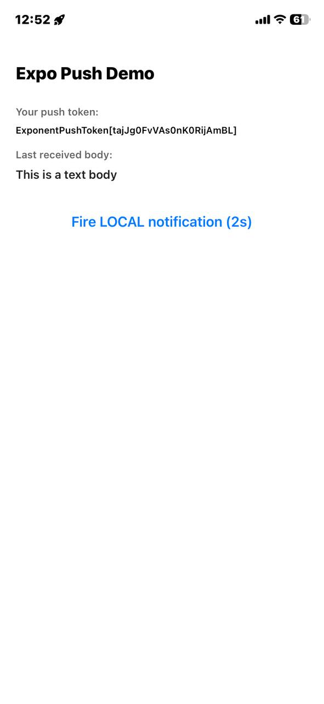

# PushDemo Report

## Introduction

In this project, I built a simple Expo React Native app to demonstrate how push notifications work in a mobile application.

## Project Goal

The main goal of this project is to show how I can make an app that:

- requests notification permission from the user
- gets an Expo push token
- listens for incoming notifications
- reacts when a notification is tapped
- schedules a local notification without using a server

## What The App Does

When the app starts, it checks whether notifications are allowed. If permission is granted, it gets the device token and displays it on the screen. The app also shows the last notification message it received.

There is one button in the app. When I press it, the app sends a local notification after 2 seconds. This helps me test the feature quickly without needing an external backend.

## How It Works

The app uses `expo-notifications`, `expo-device`, and `expo-constants`.

1. It checks whether the app is running on a real device.
2. It asks the user for notification permission.
3. It creates an Android notification channel when needed.
4. It gets the Expo push token from Expo services.
5. It listens for notifications while the app is open.
6. It detects when the user taps a notification.

## Screenshots

## Learning Outcome

This project helped me understand the basic flow of push notifications in mobile development. It is useful because it shows both the technical setup and the user experience in a simple way.

## Conclusion

PushDemo is a small but useful example of how push notifications can be added to an Expo app. It is a good starting point for learning notification handling before building a larger mobile project.
